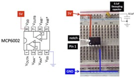
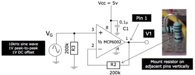

##### Department of Electrical & Electronic Engineering
##### Imperial College London

#### ELEC50001 Circuits & Systems

### Lab 1 - Amplification
##### *Peter Cheung, v3.3 - 12 October 2026*

### Introduction

In this laboratory experiment, you will refresh your memory on operational amplifiers (op-amps) and their limitations when used as an amplifier for electrical signals.  By the end of this Lab, you should be able to:
* remind yourself how to use LTSpice to simulate analogue circuits;
* implement an amplifier that works with a single power supply of +5V;
* explain how to overcome the limitation of using only a single power rail;
* explain why if the gain is too high, you need multiple stages of amplification;
* design and build both inverting and non-inverting amplifiers;
build an amplifier for a microphone signal;
* add a class-D audio amplifier module to drive low impedance speaker.

### Important Tips
Building complex circuits on the breadboard Is not easy and is very prone to errors. You will save a lot of time by following tips below:

1)	**Connect with single-core wire** – You can obtain from the Lab four 1m long single-core wires in different colours.  Use this to connect circuits on the breadboard instead of using the Male-to-Male wires.  Observe colour coding: RED for 5V, BLUE for GND, the other colours for signals.  You are provided with a wire stripper for this purpose.

2)	**Loosen the contact on breadboard* – if you are the first person to use this new breadboard. The contacts can be difficult to receive the connecting wire.  Use a M-M wire to loosen the contact will make your job much easier.  If you are NOT the first person to use the breadboard, beware that the contact may be too loose!

3)	**Use a pair of pliers for insertion** – If you have a pair of long nose pliers, grip the end of a component or a wire, and insert it into the contact hole vertically.

4)	**Draw the layout of circuit before building** – It is difficult to spot mistakes after you have inserted the components into the breadboard.  It is far easier if you first plan where the components go on a piece of paper, draw in the connection wires, and check this against the schematic (circuit) diagram.  To check the correctness of your layout, you should check off each connection one by one against the schematic after you finish your construction.

5)	**Keep your build tidy and compact** – Wires should not be much longer than needed and your circuits should be reasonably compact so that you have room for future labs.

___
**Task 1: Check the Waveform Generator (WG) on the Keysight**
---

The Keysight Scope comes with an in-built waveform generator (WG) which will be used to provide signal source for this experiment.  This task is designed for you to explore its capabilities and limitations.  
* Set up the WG to output a 1kHz sinewave with 2V amplitude and 0V offset.  Measure this using the scope and the multimeter.
* Connect the WG output using the BNC-clip cable provided to a resistor load on the breadboard as shown below.
* Measure the voltage VG with the multimeter for RL values of 100, 1k and infinite (i.e. opern circuit).  

> What conclusion can you draw about the source impedance of the WG of the Keysight Scope?  Confirm this with the manual of the Keysight Scope EDUX1002G (see course webpage).

___
**Task 2 – Unity Gain Amplifier**
---

For task 2, you will need: a MCP6002 dual operational amplifiers chip, a 0.1uF capacitor a 220 and three 200k resistors.  If any of these components are missing, just help yourself to them in the Level 1 Electronics Lab component rack. No need to ask anyone.

To mitigate the observed loading effect on the WG output, you will now build a unity gain amplifier to isolate the signal source from the output load.

### Step 1: Install the chip and 0.1uF decoupling capacitor

Plug into the breadboard the MCP6002 chip and connect the VDD (pin 8) and VSS (pin 4) of the chip to 5V and GND respectively.  Note that the chip has a notch and a small indentation on the packaging.  The pin closest to the indentation is Pin 1.

  

Insert a 0.1uF capacitor across the 5V and the GND rail as shown.  This is called a **decoupling capacitor**.  It’s function is to provide a very low impedance path for high frequency signals that somehow got onto the 5V power supply rail.  

>**YOU MUST ALWAYS DECOUPLE THE POWER SUPPLY IN ANY ELECTRONIC SYSTEMS.  IF YOU DO NOT, THE CIRCUIT MAY GO INTO OSCILLATION.  You should also use the bench power supply as your 5V power source.**

### Step 2:  Build a unity gain non-inverting buffer/amplifier
Construct the following circuit on the breadboard.  You have already connected power and ground in Step 1.  Add the 200k resistors and connect the 10kHz signal from WG to VINA+ (pin 3).  Note that the amplitude of the sine wave is 0.5V and the offset is 1V.

  

Now attached a 220$\Omega$ resistor to Vo and comment on the loading effect with and without this op-amp.

Show your breadboard circuit to a member of staff or a GTA, who will give you some feedback on the quality of your constructed circuit.  Your ability to construct neat, tidy and good quality circuit on the breadboard is not only a learning outcome, it will also save you time and effort in the long run.

### Step 3: Simulate this circuit on LTSpice
