##### Department of Electrical & Electronic Engineering
##### Imperial College London

#### ELEC50001 Circuits & Systems

### Lab 1 - Amplification
##### *Peter Cheung, v4.0 - 12 October 2026*

### Introduction

In this laboratory experiment, you will refresh your memory on operational amplifiers (op-amps) and their limitations when used as an amplifier for electrical signals.  By the end of this Lab, you should be able to:
* remind yourself how to use LTSpice to simulate analogue circuits;
* implement an amplifier that works with a single power supply of +5V;
* explain how to overcome the limitation of using only a single power rail;
* explain why if the gain is too high, you need multiple stages of amplification;
* design and build both inverting and non-inverting amplifiers;
build an amplifier for a microphone signal;
* add a class-D audio amplifier module to drive low impedance speaker.

### Important Tips
Building complex circuits on the breadboard Is not easy and is very prone to errors. You will save a lot of time by following tips below:

1)	**Connect with single-core wire** – You can obtain from the Lab four 1m long single-core wires in different colours.  Use this to connect circuits on the breadboard instead of using the Male-to-Male wires.  Observe colour coding: RED for 5V, BLUE for GND, the other colours for signals.  You are provided with a wire stripper for this purpose.

2)	**Loosen the contact on breadboard* – if you are the first person to use this new breadboard. The contacts can be difficult to receive the connecting wire.  Use a M-M wire to loosen the contact will make your job much easier.  If you are NOT the first person to use the breadboard, beware that the contact may be too loose!

3)	**Use a pair of pliers for insertion** – If you have a pair of long nose pliers, grip the end of a component or a wire, and insert it into the contact hole vertically.

4)	**Draw the layout of circuit before building** – It is difficult to spot mistakes after you have inserted the components into the breadboard.  It is far easier if you first plan where the components go on a piece of paper, draw in the connection wires, and check this against the schematic (circuit) diagram.  To check the correctness of your layout, you should check off each connection one by one against the schematic after you finish your construction.

5)	**Keep your build tidy and compact** – Wires should not be much longer than needed and your circuits should be reasonably compact so that you have room for future labs.

___
**Task 1: Check the Waveform Generator (WG) on the Keysight**
---

The Keysight Scope comes with an in-built waveform generator (WG) which will be used to provide signal source for this experiment.  This task is designed for you to explore its capabilities and limitations.  
* Set up the WG to output a 1kHz sinewave with 2V amplitude and 0V offset.  Measure this using the scope and the multimeter.
* Connect the WG output using the BNC-clip cable provided to a resistor load on the breadboard as shown below.
* Measure the voltage VG with the multimeter for RL values of 100, 1k and infinite (i.e. opern circuit).  

> What conclusion can you draw about the source impedance of the WG of the Keysight Scope?  Confirm this with the manual of the Keysight Scope EDUX1002G (see course webpage).

___
**Task 2 – Unity Gain Amplifier**
---

For task 2, you will need: a MCP6002 dual operational amplifiers chip, a 0.1uF capacitor a 220 $\Omega$ and three 200k $\Omega$ resistors.  If any of these components are missing, just help yourself to them in the Level 1 Electronics Lab component rack. No need to ask anyone.

To mitigate the observed loading effect on the WG output, you will now build a unity gain amplifier to isolate the signal source from the output load.

### Step 1: Install the chip and 0.1uF decoupling capacitor

Plug into the breadboard the MCP6002 chip and connect the VDD (pin 8) and VSS (pin 4) of the chip to 5V and GND respectively.  Note that the chip has a notch and a small indentation on the packaging.  The pin closest to the indentation is Pin 1.

  

Insert a 0.1uF capacitor across the 5V and the GND rail as shown.  This is called a **decoupling capacitor**.  It’s function is to provide a very low impedance path for high frequency signals that somehow got onto the 5V power supply rail.  

>**YOU MUST ALWAYS DECOUPLE THE POWER SUPPLY IN ANY ELECTRONIC SYSTEMS.  IF YOU DO NOT, THE CIRCUIT MAY GO INTO OSCILLATION.  You should also use the bench power supply as your 5V power source.**

### Step 2:  Build a unity gain non-inverting buffer/amplifier
Construct the following circuit on the breadboard.  You have already connected power and ground in Step 1.  Add the 200k $\Omega$ resistors and connect the 10kHz signal from WG to VINA+ (pin 3).  Note that the amplitude of the sine wave is 0.5V and the offset is 1V.

  

Now attached a 220 $\Omega$ resistor to Vo and comment on the loading effect with and without this op-amp.

Show your breadboard circuit to a member of staff or a GTA, who will give you some feedback on the quality of your constructed circuit.  Your ability to construct neat, tidy and good quality circuit on the breadboard is not only a learning outcome, it will also save you time and effort in the long run.

### Step 3: Simulate this circuit on LTSpice

You have used LTSpice for simulation last year.  The following instruction will remind you how to use LTSpice with the macro model of the MCP6001 opamp that I have created for this lab.  Details on the actual model will be discussed in a later lecture.
* Make sure you have LTSpice installed on your laptop (Windows or OSX).  In Year 1, you were told that LTSpice does not work well on Apple computers. This is not exactly correct.  LTSpice works very well on Apple laptops provided that you learn to use shortcut hotkeys, which is the preferred and faster way of designing in the first place.

* Here are the few hotkeys you would use for creating a schematic and placing built-in components such as resistor and capacitor.

 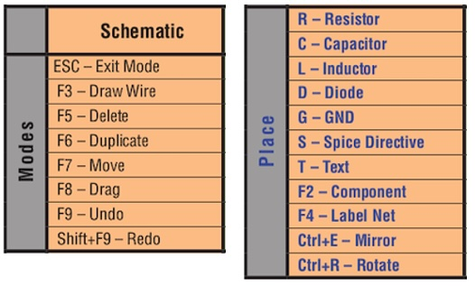 

* If you need a component from the model library, such as op-amp, transistors, diodes etc., press the F2 key and pick your component from the LTSpice library list.

*	If you are using an Apple laptop, the functions keys are used for things like volume and brightness control by default. To use these top row keys as FUNCTION keys, you need to go to setting -> keyboard and change the use of these function keys.

MCP6001/2 is not a component included in the LTSpice library.  The first step is to add this to YOUR library on your computer.  To do this:

1) Download the file MCP6001.txt from the course webpage to your lab1 folder. This file contains the following model developed by me.
2)  Open the model file within LTSpice as shown here.
3) Move your mouse to the line with .subckt and RIGHT-CLICK.  You will see a pop-up manual with a __Create Symbol__ entry. Select this. A default symbol shown below will be generated. 
4) Use “save as” to add MCP6001 to your LTSpice library in the Autogenerated folder.

 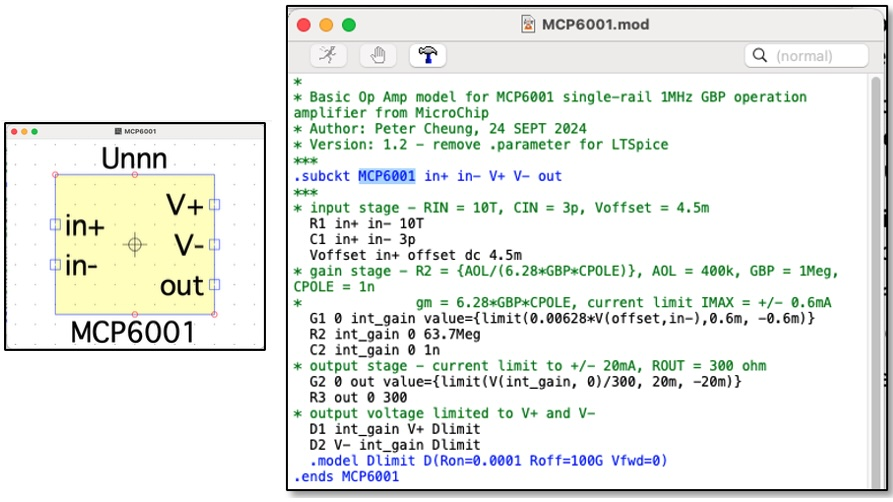 

* Create the schematic in step 2 in LTSpice using the newly created MCP6001 op-amp as shown here. Remember that you use CTRL-left click on a component to specify its parameters.

* Use the hotkey ‘s’ to bring up a SPICE directive window.  If you now LEFT-CLICK on the text pane, you will see the following pop-up menu. Select **_Analysis Cmd_**.

 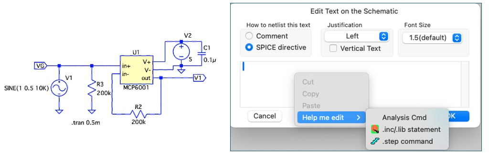 

* Now specify **_transient analysis_** for 0.5msec.  This will insert on the schematic the Spice directive **_.tran 0.5m_**.

* Now run the simulation and click on signal that you wish to plot on the schematic.

* You can also try performing small signal analysis to plot V1 voltage vs frequency.

From now on, you are expected to use LTSpice to simulate your circuit you build in Lab 1 and Lab 2.  Since this does not require lab demonstrator support, you should do all the simulation at home instead of during the lab session.

___
**Task 3:  Amplification with a gain of 4**
---
**Step 1 (Failed attempt to amplify by a gain of 4)**

  For this task, you need to use an additional 68k $\Omega$ resistor.  Remove the 200 $\Omega$ resistor at V1.  Add the resistor R1 to the circuit as shown below (shown in RED).  Show that the expected gain of this amplifier is approximately 4.  

 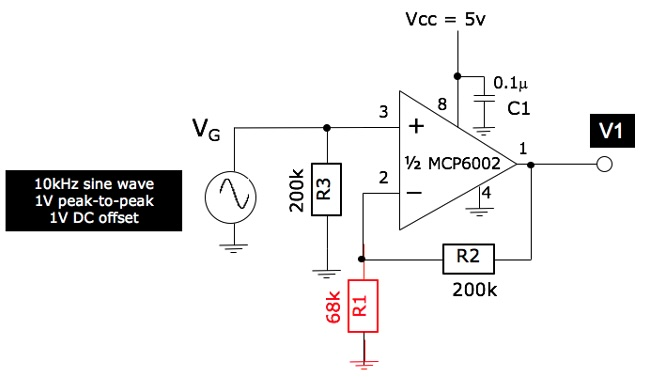 

With the applied sine wave signal, measure the output V1 on the oscilloscope.  Record the waveform of V1.   

>What is the problem with this amplifier?  Why does this happen and how might you fix this?

**Step 2 - Fixing the problem**

To fix the problem identified in Step 1, modify your previous circuit by adding a 1uF ceramic capacitor and a 10uF electrolytic capacitor as shown below.  Measure V1 on the oscilloscope and verify that the amplifier now provides a gain of 4 for the 10kHz sine wave.

 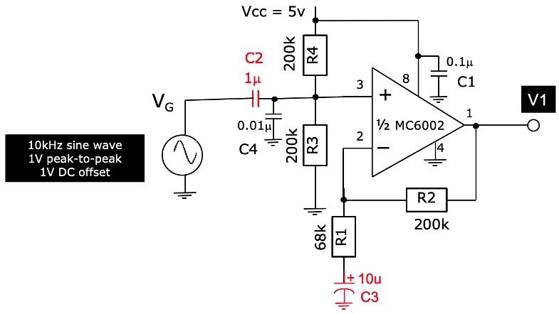 

>Why do you need R3 and R4?

>What is the gain of the amplifier for the DC offset and for the AC signal?  Why do we need C2 and C3?  What is the function of C4?

___
**Task 4:  Improved amplifier with a better bias circuit**
---
Identify the AP431i voltage reference [^1] (this looks like a 3 terminal transistor) and construct the circuit shown below.  Download the datasheet for the AP431i voltage reference.  Measure the output voltage Vref. 

>What is the output impedance of this voltage reference?  

 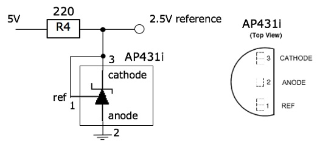 

Modify the previous circuit by adding the 2.5V voltage reference as shown below, and verify that the gain of the amplifier is as expect.  

 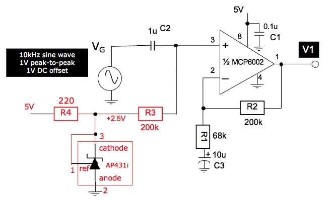 

>Why is this circuit an improvement from the previous version?

>NOTE on simulation:
You can replace the AP431i with a 2.5V DC voltage source to verify this circuit works both theoretically and in practice.  However, if you are keen to explore, a AP431i spice model in the file ‘AP431i.txt is available on the course webpage for you to download and use.  Of course, you will need to autogenerate the symbol for this device and add it to your device library before you can use it.

[^1]: AP431i voltage reference is a improved version of the original TL431 voltage reference first introduced by Texas Instrument in 1977. It has become the de facto standard, low-cost, voltage reference device in industry used extensively in switched-mode power supply applications.  For those who wants to learn and understand the inner workings of this device, see this wiki page: https://en.wikipedia.org/wiki/TL431.

___
**Task 5: Gain-Bandwidth Product limitation – large Gain failure**
---
In this task, you will explore how the gain varies with signal frequency.

 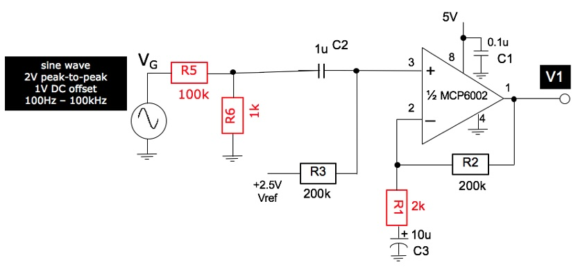 

**Step 1:** Construct a voltage divider circuit with R5 and R6 as shown above.  Generate a sine wave signal at 1kHz, 2Vpk-pk and 1Vdc offset.  

>What do you expect to see at the input of the op-amp (i.e. pin 3)?  

**Step 2:** Replace R1 with a 2k resistor.  

>What is the expected gain of your amplifier now?  Given the answer you provided in Step 1, what do you expect to see at the output of the op-amp V1?  

Confirm your prediction with the oscilloscope.

**Step 3:** Now vary the frequency from 100Hz to 100kHz in sensible steps and measure V1.   Plot the gain of this amplifier (in dB) versus frequency.  Explain the result with reference to MCP6002’s open-loop frequency response from the datasheet and the notes.

___
**Task 6: Two stage amplifier for microphone signal**
---

We have established in the previous task that a single stage amplifier with a gain of 100 will not work with signals near or above 10kHz.  To overcome this limitation, one can use two amplification stages.  We will now build a 2-stage amplifier for audio signal produced by a microphone as shown below.

>You should use both op-amp from the same package for this task – do not use separate chips.

 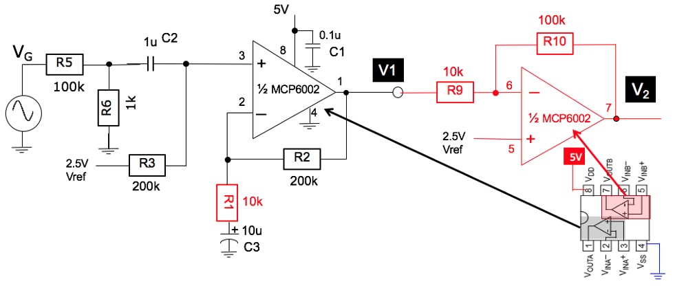 

**Step 1:** Replace R1 with a 10k resistor.  Use the second op-amp in the same package to construct the inverting amplifer and cascade your previous circuit (task 5).  

>What is the gain of stage one and stage two, and overall gain of the set up.

Verify this using the Oscilloscope.

**Step 2:**  Use the microphone provided as the signal source instead of the waveform generator of the oscilloscope according to the circuit below.  Add the 3.5mm audio jack as shown.  You should be able to amplify live audio signal captured by the microphone listen to it using a earplug connected to the 3.5mm jack breakout board.  

 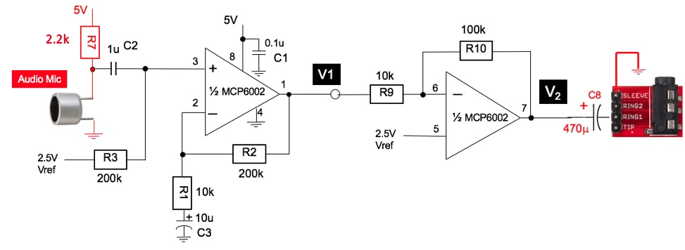 

>What are the purposes of R7 and C8 in this circuit?

You will find in your Lab-in-a-Box there is an 8 $\Omega$ speaker.  Connect this to the op-amp output V2 via the series capacitor C8.  

>What do you expect will happen?  Why?

___
**Task 7: Driving a low impedance load using a class-D audio amplifier**
---

To drive a speaker with such as low resistance load, an ordinary op-amp such as the MCP6002 will not work.  The output current is limited to ±23mA or lower.  You need a special type of amplifier called an audio amplifier.   

Provided for you is a PAM8302A class-D audio amplifier module.  Datasheet for this device is available for download on the course webpage.  The working of a class-D amplifier will be explained at a later lecture.  

Test the audio amplifier with the circuit shown below.  You should hear the difference between the sound with and without this amplifier.

 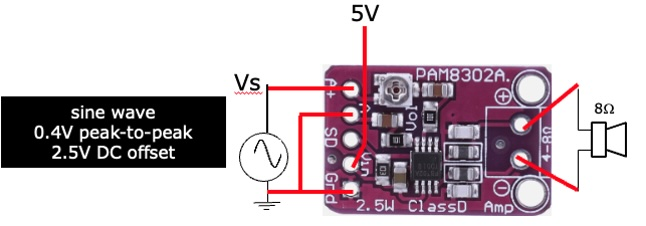 

Instead of using the WG to generate sine wave signals, you can connect this module to your circuit from the previous task. You now have a audio system from microphone, amplifier to speaker.

___
Congratulations! You have completed Lab 1.  You should keep these circuits on the breadboard because you will be needing some of them later for future Labs.
___

#### ADDITION NOTE

You may find that due to the high gain of the two-stage microphone amplifier, and the 24dB additional gain of the audio amplifier, there exists a feedback path from the speaker back to the microphone, resulting in a positive feedback scenario.
Such position feedback may manifest itself as perioding pulsing sound or continuous tone screaming from the speaker.  To avoid this, you will need to reduce the gain either of the two-stage microphone amplifier, or better, the gain of the class D audio amplifier.  Ask one of the staff to use the trimmer to adjust the potentiometer ont eh PAM8302A module to reduce the gain from 24dB to much lower. The oscillation will stop and you also avoid annoying neighborouring students!  
